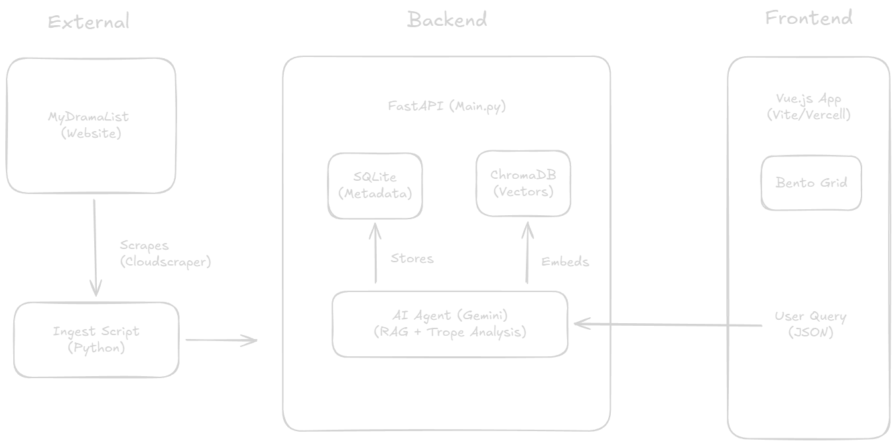

# 🎬 Drama Discovery Engine

> **An AI-powered RAG search engine that finds K-Dramas based on vibes, tropes, and narrative context.**

<!-- The GIF Display -->


🔴 **[Live Demo](https://drama-discovery-engine.vercel.app)**

## 🚀 The Problem
Traditional search engines (MyDramaList, Netflix) rely on static metadata. They fail at answering human queries like:
> *"I want a thriller about corruption with a cold male lead who softens up, released after 2020."*

LLMs (ChatGPT) hallucinate shows that don't exist.

## 💡 The Solution
I engineered a **Hybrid Search System** that combines:
1.  **Deterministic Filtering:** SQL constraints for Rating, Year, and Genre.
2.  **Semantic Search:** Vector Embeddings (ChromaDB) to understand narrative "vibes."
3.  **Data Enrichment Agent:** An offline LLM pipeline that analyzes thousands of user reviews to tag shows as **"Underrated"** or **"Overrated"** and extract tropes not found in official metadata.

## 🛠️ Tech Stack
*   **Frontend:** Vue 3, Vite, Tailwind-style CSS (Glassmorphism), Lucide Icons.
*   **Backend:** FastAPI, Python.
*   **AI & Data:** Google Gemini 2.5 Flash, LangChain, HuggingFace Embeddings, ChromaDB (Vector Store), SQLite.
*   **Data Pipeline:** Custom `Cloudscraper` implementation for deep pagination and metadata extraction.

## 🏗️ System Architecture



1.  **Ingestion:** Scraper collects data + reviews from MyDramaList.
2.  **Analysis Agent:** Gemini Flash analyzes reviews -> Extracts "Verdict" & "Tropes" -> Updates SQL.
3.  **Indexing:** Data is embedded into ChromaDB.
4.  **Inference:** User Query -> Hybrid Filter -> RAG Retrieval -> Gemini Synthesis -> UI.

## ✨ Key Features
*   **🏆 Hybrid Search:** Filters by Year/Rating (Hard filter) + Plot Description (Soft filter).
*   **🧠 Trope Hunter:** AI detects specific themes like *#ContractMarriage* or *#Revenge* from user reviews.
*   **⚖️ Community Verdict:** System calculates if a show is "Underrated" based on the disparity between official score and review sentiment.
*   **🍿 Rich UI:** "Netflix-style" carousel, dynamic poster fetching, and bookmarking system.

## ⚡ How to Run Locally

1. **Clone the repo**
   ```bash
   git clone https://github.com/yourusername/drama-discovery-engine.git